# 1. Компоненты электронных устройств

## Тест 1.1

**Вопрос:** Резисторы, у которых можно изменять сопротивление только при регулировке мли ремонте аппаратуры - ...

**Ответ:** переменные подстроечные резисторы

---

**Вопрос:** Условное графическое обозначение терморезистора ...

**Ответ:** 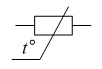

---

**Вопрос:** Резисторы, у которых можно изменять сопротивление во время функционирования аппаратуры - ...

**Ответ:** переменные регулировочные резисторы

---

**Вопрос:** Условное графическое обозначение резистора с номинальной рассеиваемой мощностью 5 Вт ...

**Ответ:** 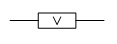

---

## Тест 1.2

**Вопрос:** Ряды номиналов конденсаторов постоянной ёмкости , в которые входит конденсатор с ёмкостью 27 нФ ... 

**Ответ:** Е12, Е24

---

**Вопрос:** Ряды номиналов конденсаторов постоянной ёмкости , в которые входит конденсатор с ёмкостью 43 мкФ ... 

**Ответ:** Е24

---

## Тест 1.3

**Вопрос:** Стабилитрон ... 

**Ответ:** 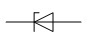

---

**Вопрос:** Вольт-амперная характеристика диода это зависимость ... 

**Ответ:** тока через диод от приложенного к нему напряжения

---

**Вопрос:** Условное графическое изображение ... 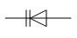

**Ответ:** варикап

---

**Вопрос:** Диод ... 

**Ответ:** 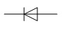

---

## Тест 1.4

Вопрос: Среднечастотный биполярный транзистор малой мощности ... 

Ответ: КТ203А

---

**Вопрос:** Кремниевые транзисторы ... 

**Ответ:** КТ805Б, КТ203А, КТ503Д, КТ704А, КТ908А, КТ361Г, КТ620Б

---

**Вопрос:** Германиевые транзисторы ... 

**Ответ:** ГТ115А, ГТ402В

---

**Вопрос:** Биполярный транзистор типа n-p-n ... 

**Ответ:** 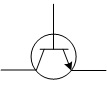

---

## Тест 1.5

**Вопрос:** Электрод, создающий управляющее электрическое поле, называется ... 

**Ответ:** затровом

---

**Вопрос:** Условное графическое обозначение полевых транзисторов с индуцированным каналом n-типа ... 

**Ответ:** 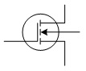

---

**Вопрос:** У транзисторов с управляющим p-n-переходом с увеличением обратного напряжения приложенного к затвору сопротивление канала ... 

**Ответ:** увеличивается

---

## Тест 1.6

**Вопрос:** ИС К555ИД7 содержит ... 

**Ответ:** дешифратор

---

**Вопрос:** Корпус ИС типа 1 - ... 

**Ответ:** 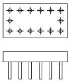

---

**Вопрос:** ИС КР1533ТР2 содержит - ... 

**Ответ:** RS- триггер

---

**Вопрос:** И133ЛА3 - ... 

**Ответ:** интегральная схема с плоскими, планарными выводами 

---

**Вопрос:** Корпус ИС типа 2 - ... 

**Ответ:** 

---

**Вопрос:** Корпус ИС типа - ... 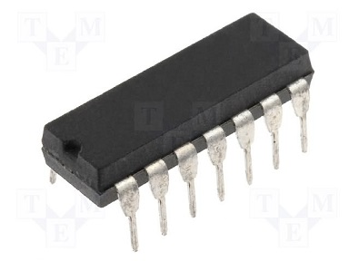

**Ответ:** DIP14

---

# 2. Логические основы цифровой схемотехники

## Тест 2.1

**Вопрос:** Функция И ... 

**Ответ:** 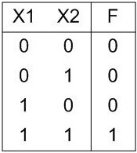

---

**Вопрос:** Функция алгебры логики, представленная таблицей ... 

**Ответ:** конъюнкции, логического умножения

---

**Вопрос:** 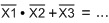

**Ответ:** 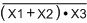

---

## Тест 2.2

**Вопрос:** 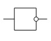

**Ответ:** инвертор

---

**Вопрос:** УГО логических элементов ИЛИ - ... 

**Ответ:** 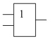 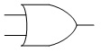

---

**Вопрос:** УГО логических элементов НЕ - ... 

**Ответ:**  

---

# 3. Особенности работы и основные параметры ЛЭ

## Тест 3.1

**Вопрос:** С точки зрения защиты от внутренних помех амплитуда рабочих сигналов ЛЭ обычно выбирается ... 

**Ответ:** минимально возможной 

---

**Вопрос:** Входные сигналы ЛЭ с амплитудой больше Up (напряжения переключания элемента) ... 

**Ответ:** усиливаются

---

**Вопрос:** Ток потребления в состоянии логического нуля (Iпот0) – потребляемый ток логического элемента при ... 

**Ответ:** Uвых = U0 

---

# 4. Базовые логические элементы

## Тест 4.1

**Вопрос:** Коэффициент нагрузки для данной схемы - ... 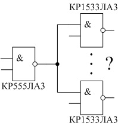

**Ответ:** 40

---

**Вопрос:** Если на входе EI напряжение логической "0", то работа ЛЭ ... 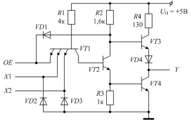

**Ответ:** запрещена

---

**Вопрос:** Увеличение номинала внешнего нагрузочного резистора R приведёт к ... 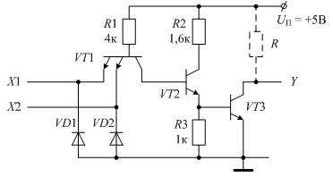

**Ответ:**

- понижению помехоустойчивости 
- понижению нагрузочного тока выходного каскада 
- понижению потребляемой мощности 
- понижению быстродействия 

---

**Вопрос:** Уменьшение номинала внешнего нагрузочного резистора R приведёт к ... 

**Ответ:** 

- повышению потребляемой мощности 
- повышению нагрузочного тока выходного каскада 
- повышению быстродействия 

---

**Вопрос:** Логическая функция, реализуемая схемой ... 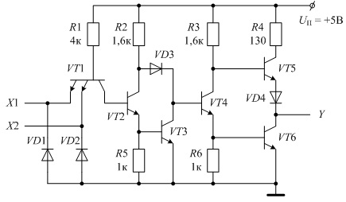

**Ответ:** 2И 

---

**Вопрос:** Если на входе EI напряжение логического "0", то транзисторы ... 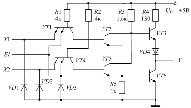

**Ответ:** VT2 - закрыт, VT5 - закрыт

---

**Вопрос:** Коэффициент нагрузки для данной схемы - ... 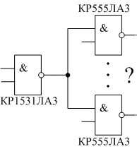

**Ответ:** 55

---

**Вопрос:** Если на входе NOE напряжение логической "1", то транзисторы ... 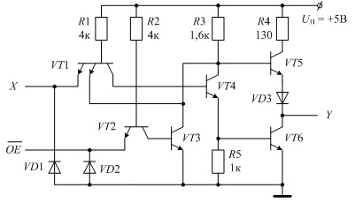

**Ответ:**

- VT2 - закрыт, VT3 - открыт 
- VT5 - закрыт, VT6 - закрыт 

---

**Вопрос:** Если на вход Х подано напряжение 0В, то транзистор VT3 - ... 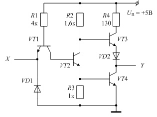

**Ответ:** открыт

---

**Вопрос:** Схема с третьим состоянием и разрешением по ... 

**Ответ:** выходу

---

**Вопрос:** Если на вход Х подано напряжение +5В, то транзистор VT3 - ... 

**Ответ:** закрыт

---

**Вопрос:** Коэффициент нагрузки для данной схемы - ... 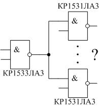

**Ответ:** 13

---

**Вопрос:** Если на вход Х подано напряжение +5В, то транзистор VT2 - ... 

**Ответ:** открыт

---

**Вопрос:** Соединение выходов нескольких ЛЭ с открытым коллектором эквивалентно реализации логической функции ... 

**Ответ:** ИЛИ

---

**Вопрос:** Максимальное число входов ЛЭ серии К531, которые можно подключить к выходу ЛЭ серии К155 - ... 

**Ответ:** 8

---

**Вопрос:** Тип ИС серии КР1531 - ... 

**Ответ:** ТТЛШ

---

**Вопрос:** Коэффициент нагрузки для данной схемы - ... 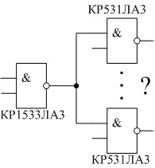

**Ответ:** 4

---

**Вопрос:** ИС серии К131 относятся к ... 

**Ответ:** мощным ИС 

---

**Вопрос:** Если на входе EI напряжение логической "1", то работа ЛЭ ... 

**Ответ:** разрешена

---

**Вопрос:** Если на вход Х подано напряжение +5В, то транзистор VT4 - ... 

**Ответ:** открыт

---

**Вопрос:** Тип ИС серии К156 - ... 

**Ответ:** ДТЛ

---

**Вопрос:** В схеме базового стандартного ЛЭ ТТЛ к фазорасщепителю относятся элементы ... 

**Ответ:** R2, VT2, R3 

---

**Вопрос:** Если на входе EI напряжение логического "0", то работа ЛЭ ... 

**Ответ:** запрещена

---

**Вопрос:** Если на вход Х подано напряжение 0В, то транзистор VT4 - ... 

**Ответ:** закрыт

---

## Тест 4.2

**Вопрос:** При увеличении частоты переключения потребляемая мощность у ЛЭ КМОП ... 

**Ответ:** возрастает

---

**Вопрос:** В полной эквивалентной схеме инвертора КМОП диод VD6 защищает ... 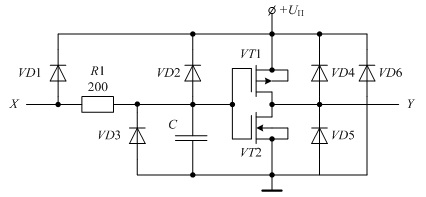

**Ответ:** каналы транзисторов от ошибочной перемены полярности питания 

---

**Вопрос:** Входное сопротивление ЛЭ КМОМ по сравнению с ЛЭ ТТЛ и ТТЛШ - ... 

**Ответ:** больше

---

**Вопрос:** При подаче на вход Х напряжения U = Uп - ... 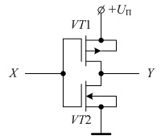

**Ответ:** VT1 - закрыт, VT2 - открыт 

---

**Вопрос:** При увеличении длительности фронтов входного сигнала потребляемая мощность у ЛЭ КМОП ... 

**Ответ:** возрастает

---

**Вопрос:** Схема, реализующая логическую функцию "ИЛИ-НЕ" - ... 

**Ответ:** 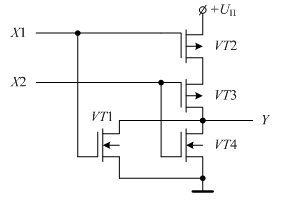

---

**Вопрос:** Свободные входы КМОП элементов ... 

**Ответ:** нельзя оставлять неприсоединёнными 

---

**Вопрос:** Выходы ЛЭ КМОП без третьего состояния ... 

**Ответ:** нельзя соединять между собой 

---

**Вопрос:** Логическая функция, реализуемая схемой - ... 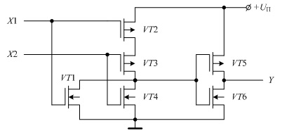

**Ответ:** ИЛИ

---

**Вопрос:** В полной эквивалентной схеме инвертора КМОП конденсатор С символизирует ... 

**Ответ:** входную ёмкость данного ЛЭ 

---

**Вопрос:** В полной эквивалентной схеме инвертора КМОП диоды VD1 – VD3 защищают ... 

**Ответ:** изоляцию затворов транзисторов VT1 и VT2 от пробоя 

---

# 5. ОСНОВНЫЕ ФУНКЦИОНАЛЬНЫЕ УЗЛЫ КОМБИНАЦИОННОГО ТИПА

## Тест 5.1

**Вопрос:** Комбинация логических сигналов на входе дешифратора К155ИД4 - ... 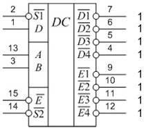

**Ответ:**

✔️ 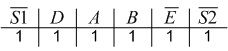

✔️ 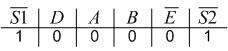

✔️ 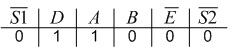

✔️ 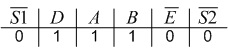

**Примечание:** "Ваш ответ частично правильный. Вы выбрали слишком много вариантов." Но ответ засчитывает. Возможно, последний вариант - неверный.

---

**Вопрос:** Комбинация логических сигналов на входе дешифратора К155ИД4 - ... 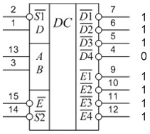

**Ответ:** 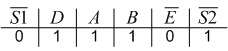

---

**Вопрос:** Комбинация логических сигналов на входе дешифратора К155ИД4 - ... 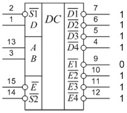

**Ответ:** 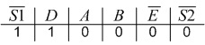

---

**Вопрос:** Комбинация логических сигналов на входе дешифратора К155ИД4 - ... 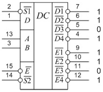

**Ответ:** 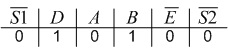

---

**Вопрос:** Комбинация логических сигналов на входе дешифратора К155ИД4 - ... 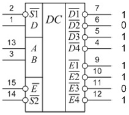

**Ответ:** Выходные сигналы на рисунке не соответсвуют логике работы данного дешифратора 

---

**Вопрос:** Комбинация логических сигналов на входе дешифратора К155ИД4 - ... 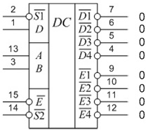

**Ответ:** Выходные сигналы на рисунке не соответсвуют логике работы данного дешифратора 

---

**Вопрос:** Комбинация логических сигналов на входе дешифратора К155ИД4 - ... 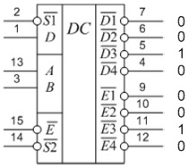

**Ответ:** Выходные сигналы на рисунке не соответсвуют логике работы данного дешифратора 

---

**Вопрос:** В комбинационных схемах выходной сигнал в текщий момент времени зависит от ... 

**Ответ:** текущих значений входных сигналов 

---

**Вопрос:** ФАЛ, реализуемая схемой - ... 

**Ответ:** 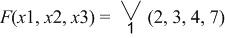

---

**Вопрос:** ФАЛ, реализуемая схемой - ... 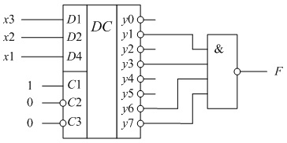

**Ответ:** 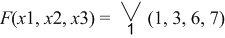

---

**Вопрос:** ФАЛ, реализуемая схемой - ... 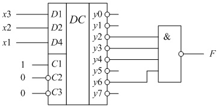

**Ответ:** 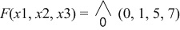

---

**Вопрос:** ФАЛ, реализуемая схемой - ... 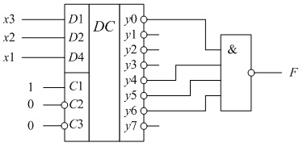

**Ответ:**

- 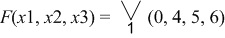
- 

---

**Вопрос:** ФАЛ, реализуемая схемой - ... 

**Ответ:**
- 
- 

---

**Вопрос:** ФАЛ, реализуемая схемой - ... 

**Ответ:** 

---

**Вопрос:** ФАЛ, реализуемая схемой - ... 

**Ответ:** 

---

**Вопрос:** ФАЛ, реализуемая схемой - ... 

**Ответ:**

- 
- 

---

**Вопрос:** Реализация логической функции - ... 

**Ответ:** 

---

**Вопрос:** Реализация логической функции - ... 

**Ответ:** 

---

**Вопрос:** Реализация логической функции - ... 

**Ответ:** 

---

**Вопрос:** Реализация логической функции - ... 

**Ответ:** 

---

**Вопрос:** Реализация логической функции - ... 

**Ответ:** 

---

**Вопрос:** Реализация логической функции - ... 

**Ответ:** 

---

**Вопрос:** Реализация логической функции - ... 

**Ответ:** 

---

**Вопрос:** УГО дешифратора, работающего согласно следующей таблице истинности ... 

**Ответ:** 

---

**Вопрос:** УГО дешифратора, работающего согласно следующей таблице истинности ... 

**Ответ:** 

---

**Вопрос:** УГО дешифратора, работающего согласно следующей таблице истинности ... 

**Ответ:** 

---

**Вопрос:** УГО дешифратора, работающего согласно следующей таблице истинности ... 

**Ответ:** 

---

**Вопрос:** УГО дешифратора, работающего согласно следующей таблице истинности ... 

**Ответ:** 

---

**Вопрос:** УГО дешифратора, работающего согласно следующей таблице истинности ... 

**Ответ:** 

---

**Вопрос:** УГО дешифратора, работающего согласно следующей таблице истинности ... 

**Ответ:** 

---

**Вопрос:** УГО дешифратора, работающего согласно следующей таблице истинности ... 

**Ответ:** 

---

**Вопрос:** Логические сигналы на выходе дешифратора К155ИД3 - ... 

**Ответ:** 

---

**Вопрос:** Логические сигналы на выходе дешифратора К155ИД3 - ... 

**Ответ:** 

---

**Вопрос:** Логические сигналы на выходе дешифратора К155ИД3 - ... 

**Ответ:** 

---

**Вопрос:** Логические сигналы на выходе дешифратора К155ИД3 - ... 

**Ответ:** 

---

**Вопрос:** Логические сигналы на выходе дешифратора К155ИД3 - ... 

**Ответ:** 

---

**Вопрос:** Логические сигналы на выходе дешифратора К155ИД3 - ... 

**Ответ:** 

---

**Вопрос:** Логические сигналы на выходе дешифратора К155ИД3 - ... 

**Ответ:** 

---

**Вопрос:** Логические сигналы на выходе дешифратора К155ИД3 - ... 

**Ответ:** 

---

**Вопрос:** Дешифратор называется полным, если число адресных входов n и число выходов m - ... 

**Ответ:** 
- 
- 

**Примечание:** Иногда правильный один, иногда - другой 🤷

---

**Вопрос:** Логические сигналы на выходе дешифратора К155ИД4 - ... 

**Ответ:** 

---

**Вопрос:** Логические сигналы на выходе дешифратора К155ИД4 - ... 

**Ответ:** 

---

**Вопрос:** Логические сигналы на выходе дешифратора К155ИД4 - ... 

**Ответ:** 

---

**Вопрос:** Логические сигналы на выходе дешифратора К155ИД4 - ... 

**Ответ:** 

---

**Вопрос:** Логические сигналы на выходе дешифратора К155ИД4 - ... 

**Ответ:** 

---

**Вопрос:** Логические сигналы на выходе дешифратора К155ИД4 - ... 

**Ответ:** 

---

**Вопрос:** Логические сигналы на выходе дешифратора К155ИД4 - ... 

**Ответ:** 

---

**Вопрос:** Логические сигналы на выходе дешифратора К155ИД4 - ... 

**Ответ:** 

---

**Вопрос:** Логические сигналы на выходе дешифратора К155ИД4 - ... 

**Ответ:** 

---

**Вопрос:** Логические сигналы на выходе дешифратора К155ИД4 - ... 

**Ответ:** 

---

**Вопрос:** Выходы дешифратора можно обозначать ... 

**Ответ:** 

✔️ буквенно-цифровым кодом, например, Q0, Q1, Q2 и т.д. 

✔️ цифрами по порядку 0, 1, 2, 3 и т.д. 

**Примечание:** Эти 2 варианта - точно правильные. Возможно, третий тоже правильный, но должно засчитать и так.

---

**Вопрос:** Таблица истинности полного дешифратора ... 

**Ответ:**

- 
- 

---

**Вопрос:** Таблица истинности полного дешифратора ... 

**Ответ:** 

---

**Вопрос:** Таблица истинности полного дешифратора ... 

**Ответ:**
- 
- 

---

**Вопрос:** Таблица истинности полного дешифратора ... 

**Ответ:**
- 
- 

---

**Вопрос:** Риски - это ... 

**Ответ:** временные сигналы на выходе ЛЭ возникающие во время переходных процессов 

---

**Вопрос:** Дешифратор - ... 

**Ответ:**
- неполный линейный 
- полный линейный 

**Примечание:** Да, похоже, что подходят 2 варианта. Стоит предпочесть первый вариант.

---

**Вопрос:** Дешифратор - ... 

**Ответ:**

- неполный пирамидальный 
- полный пирамидальный 

**Примечание:** Да, похоже, что подходят 2 варианта. Стоит предпочесть первый вариант.

---

**Вопрос:** Входы дешифратора обозначают ... 

**Ответ:**

✔️ их двоичными весами 1, 2, 4, 8 и т.д.

✔️ буквенно-цифровым кодом, например, D0, D1, D2 и т.д. 

✔️ буквенным кодом A, B, C, D 

**Примечание:** Должны быть эти 3, но, возможно, все 4.

---

**Вопрос:** Основные характеристики, по которым оцениваются дешифратор и шифратор - ... 

**Ответ:**

✔️ быстродействие – максимальная задержка сигнала при прохождении его от входа схемы к выходу 

✔️ сложность схемы, оцениваемая количеством оборудования, составляющего схему 

---

**Вопрос:** Комбинация входных сигналов, при которой на выходах дешифратора КР1533ИД7 получим следующие выходные сигналы - ... 

**Ответ:**

✔️ 

✔️ 

✔️ 

✔️ 

**Примечание:** "Ваш ответ частично правильный. Вы правильно выбрали 3." Но ответ засчитывает. Возможно, последний вариант - неверный.

---

**Вопрос:** Комбинация входных сигналов, при которой на выходах дешифратора КР1533ИД7 получим следующие выходные сигналы - ... 

**Ответ:** 

---

**Вопрос:** Комбинация входных сигналов, при которой на выходах дешифратора КР1533ИД7 получим следующие выходные сигналы - ... 

**Ответ:** 

---

**Вопрос:** Комбинация входных сигналов, при которой на выходах дешифратора КР1533ИД7 получим следующие выходные сигналы - ... 

**Ответ:** Выходные сигналы на рисунке не соответсвуют логике работы данного дешифратора 

---

**Вопрос:** ИС К1533ИД7 ... 

**Ответ:** 

---

**Вопрос:** Комбинация логических сигналов на входе дешифратора К155ИД3 - ... 

**Ответ:**

✔️ 
✔️ 
✔️ 
✔️ 

**Примечание:** "Ваш ответ частично правильный. Вы правильно выбрали 4." Ответ засчитывает, но не всё отмечено.

---

**Вопрос:** Комбинация логических сигналов на входе дешифратора К155ИД3 - ... 

**Ответ:** Выходные сигналы на рисунке не соответсвуют логике работы данного дешифратора 

---

**Вопрос:** Комбинация логических сигналов на входе дешифратора К155ИД3 - ... 

**Ответ:** Выходные сигналы на рисунке не соответсвуют логике работы данного дешифратора 

---

**Вопрос:** Комбинационная схема, предназначенная для преобразования двоичного позиционного кода в унитарный, называется ... 

**Ответ:** дешифратор

---

**Вопрос:** Основные характеристики комбинационных схем - ... 

**Ответ:**

✔️ быстродействие

✔️ сложность

**Примечание:** Должны быть эти 2, но могут быть все 3.

---

**Вопрос:** Логические сигналы на выходе дешифратора К555ИД6 - ... 

**Ответ:** 

---

**Вопрос:** Логические сигналы на выходе дешифратора К555ИД6 - ... 

**Ответ:** 

---

**Вопрос:** Логические сигналы на выходе дешифратора К555ИД6 - ... 

**Ответ:** 

---

**Вопрос:** Логические сигналы на выходе дешифратора К555ИД6 - ... 

**Ответ:** 

---

**Вопрос:** Логические сигналы на выходе дешифратора К555ИД6 - ... 

**Ответ:** 

---

**Вопрос:** Логические сигналы на выходе дешифратора К555ИД6 - ... 

**Ответ:** 

---

**Вопрос:** Логические сигналы на выходе дешифратора К555ИД6 - ... 

**Ответ:** 

---

**Вопрос:** Если число входов дешифратора n=3, то число выходов - ... 

**Ответ:** 8

---

**Вопрос:** ИС К555ИД6 ... 

**Ответ:** 

---

**Вопрос:** Дешифратор имеющий наименьшие аппаратурные затраты при большом числе разрядов - ... 

**Ответ:** матричный

---

**Вопрос:** Дешифратор имеет ... 

**Ответ:** несколько входов и несколько выходов 

---

**Вопрос:** Если число входов дешифратора n=4, то число выходов - ... 

**Ответ:** 16

---

**Вопрос:** ИС К155ИД3 ... 

**Ответ:** 

---

**Вопрос:** Дешифратор преобразует ... 

**Ответ:** позиционный двоичный код в двоичный унитарный 

---

**Вопрос:** ИС К155ИД4 ... 

**Ответ:** 

---

**Вопрос:** Двоично-десятичный дешифратор - ... 

**Ответ:**

✔️ 

✔️ 

---

**Вопрос:** Полный дешифратор - ... 

**Ответ:**

✔️ 

✔️ 

✔️ 

**Примечание:** "Ваш ответ частично правильный. Вы выбрали слишком много вариантов." Но ответ засчитывает.

---

## Тест 5.2

**Вопрос:** Таблица истинности полного шифратора ... 

**Ответ:** 

---

**Вопрос:** Таблица истинности полного шифратора ... 

**Ответ:** 

---

**Вопрос:** Таблица истинности полного шифратора ... 

**Ответ:** 

---

**Вопрос:** УГО шифратора, реализующего следующую таблицу истинности ... 

**Ответ:** 

---

**Вопрос:** Если число информационных входов указателя старшей единицы n=4, то число информационных выходов - ... 

**Ответ:** 4

---

**Вопрос:** Если число информационных входов шифратора n=6, то число информационных выходов - ... 

**Ответ:** 3

---

**Вопрос:** В отечественных сериях микросхем шифраторы имеют в названии буквы ... 

**Ответ:** ИВ

---

**Вопрос:** Если число информационных входов шифратора n=8, то число информационных выходов - ... 

**Ответ:** 3

---

## Тест 5.3

**Вопрос:** Комбинационная схема, предназначенная для коммутации сигналов от одного из нескольких источников к одному приёмнику, называется ... 

**Ответ:** мультиплексор

---

**Вопрос:** Мультиплексор - ... 

**Ответ:** 

---

**Вопрос:** Мультиплексор - ... 

**Ответ:** 4-канальный 2-разрядный 

---

**Вопрос:** Мультиплексор - ... 

**Ответ:** 8-канальный 1-разрядный 

---

**Вопрос:** Мультиплексор - ... 

**Ответ:** 2-канальный 4-разрядный 

---

**Вопрос:** Мультиплексор - ... 

**Ответ:** 4-канальный 2-разрядный 

---

**Вопрос:** Мультиплексор - ... 

**Ответ:** 2-канальный 4-разрядный 

---

**Вопрос:** Мультиплексор - ... 

**Ответ:** 4-канальный 2-разрядный 

---

**Вопрос:** Выходные сигналы мультиплексора КР1533КП12 - ... (Z - третье состояние) 

**Ответ:** Y0=1, Y1=0 

---

**Вопрос:** Выходные сигналы мультиплексора КР1533КП12 - ... (Z - третье состояние) 

**Ответ:** Y0=Z, Y1=0 

---

**Вопрос:** Выходные сигналы мультиплексора КР1533КП12 - ... (Z - третье состояние) 

**Ответ:** Y0=0, Y1=Z 

---

**Вопрос:** Выходные сигналы мультиплексора КР1533КП12 - ... (Z - третье состояние) 

**Ответ:** Y0=Z, Y1=Z 

---

**Вопрос:** Выходные сигналы мультиплексора КР1533КП12 - ... (Z - третье состояние) 

**Ответ:** Y0=1, Y1=Z 

---

**Вопрос:** Выходные сигналы мультиплексора КР1533КП12 - ... (Z - третье состояние) 

**Ответ:** Y0=Z, Y1=Z 

---

**Вопрос:** Выходные сигналы мультиплексора КР1533КП12 - ... (Z - третье состояние) 

**Ответ:** Y0=1, Y1=0 

---

**Вопрос:** Выходные сигналы мультиплексора КР1533КП12 - ... (Z - третье состояние) 

**Ответ:** Y0=0, Y1=1 

---

**Вопрос:** Выходные сигналы мультиплексора КР1533КП12 - ... (Z - третье состояние) 

**Ответ:** Y0=1, Y1=Z 

---

**Вопрос:** Выходные сигналы мультиплексора КР1533КП12 - ... (Z - третье состояние) 

**Ответ:** Y0=Z, Y1=Z 

---

**Вопрос:** Выходные сигналы мультиплексора КР1533КП12 - ... (Z - третье состояние) 

**Ответ:** Y0=Z, Y1=1 

---

**Вопрос:** Выходные сигналы мультиплексора КР1533КП12 - ... (Z - третье состояние) 

**Ответ:** Y0=1, Y1=Z 

---

**Вопрос:** Выходные сигналы мультиплексора КР1533КП12 - ... (Z - третье состояние) 

**Ответ:** Y0=0, Y1=0 

---

**Вопрос:** Мультиплексор, реализующий данную ФАЛ - ... 

**Ответ:** 

---

**Вопрос:** Мультиплексор, реализующий данную ФАЛ - ... 

**Ответ:** 

---

**Вопрос:** Мультиплексор, реализующий данную ФАЛ - ... 

**Ответ:** 

---

**Вопрос:** Мультиплексор, реализующий данную ФАЛ - ... 

**Ответ:** 

---

**Вопрос:** Мультиплексор, реализующий данную ФАЛ - ... 

**Ответ:** 

---

**Вопрос:** Мультиплексор, реализующий данную ФАЛ - ... 

**Ответ:** 

---

**Вопрос:** Мультиплексор, реализующий данную ФАЛ - ... 

**Ответ:** 

---

**Вопрос:** Мультиплексор, реализующий данную ФАЛ - ... 

**Ответ:** 

---

**Вопрос:** Мультиплексор, реализующий данную ФАЛ - ... 

**Ответ:** 

---

**Вопрос:** Выходные сигналы мультиплексора КР1533КП11 - ... (Z - третье состояние) 

**Ответ:** Y0=1, Y1=0, Y2=0, Y3=1 

---

**Вопрос:** Выходные сигналы мультиплексора КР1533КП11 - ... (Z - третье состояние) 

**Ответ:** Y0=1, Y1=0, Y2=1, Y3=0 

---

**Вопрос:** Выходные сигналы мультиплексора КР1533КП11 - ... (Z - третье состояние) 

**Ответ:** Y0=Z, Y1=Z, Y2=Z, Y3=Z 

---

**Вопрос:** Выходные сигналы мультиплексора КР1533КП11 - ... (Z - третье состояние) 

**Ответ:** Y0=Z, Y1=Z, Y2=Z, Y3=Z 

---

**Вопрос:** Выходные сигналы мультиплексора КР1533КП11 - ... (Z - третье состояние) 

**Ответ:** Y0=0, Y1=1, Y2=1, Y3=0 

---

**Вопрос:** Выходные сигналы мультиплексора КР1533КП11 - ... (Z - третье состояние) 

**Ответ:** Y0=Z, Y1=Z, Y2=Z, Y3=Z 

---

**Вопрос:** Выходные сигналы мультиплексора КР1533КП11 - ... (Z - третье состояние) 

**Ответ:** Y0=0, Y1=1, Y2=1, Y3=0 

---

**Вопрос:** Выходные сигналы мультиплексора КР1533КП11 - ... (Z - третье состояние) 

**Ответ:** Y0=0, Y1=1, Y2=0, Y3=1 

---

**Вопрос:** Выходные сигналы мультиплексора КР1533КП11 - ... (Z - третье состояние) 

**Ответ:** Y0=Z, Y1=Z, Y2=Z, Y3=Z 

---

**Вопрос:** Выходные сигналы мультиплексора КР1533КП11 - ... (Z - третье состояние) 

**Ответ:** Y0=Z, Y1=Z, Y2=Z, Y3=Z 

---

**Вопрос:** 4

**Ответ:** Y = 0, NY = 1 

---

**Вопрос:** Выходные сигналы мультиплексора КР1533КП7 - ... 

**Ответ:** Y = 1, NY = 0 

---

**Вопрос:** Выходные сигналы мультиплексора КР1533КП7 - ... 

**Ответ:** Y = 0, NY = 1 

---

**Вопрос:** Выходные сигналы мультиплексора КР1533КП7 - ... 

**Ответ:** Y = 0, NY = 1 

---

**Вопрос:** Выходные сигналы мультиплексора КР1533КП7 - ... 

**Ответ:** Y = 0, NY = 1 

---

**Вопрос:** Выходные сигналы мультиплексора КР1533КП7 - ... 

**Ответ:** Y = 0, NY = 1 

---

**Вопрос:** Выходные сигналы мультиплексора КР1533КП7 - ... 

**Ответ:** Y = 1, NY = 0 

---

**Вопрос:** Выходные сигналы мультиплексора КР1533КП7 - ... 

**Ответ:** Y = 0, NY = 1 

---

**Вопрос:** Выходные сигналы мультиплексора КР1533КП7 - ... 

**Ответ:** Y = 1, NY = 0 

---

**Вопрос:** ФАЛ, реализуемая на мультиплексоре КР1533КП7 - ... 

**Ответ:** 

---

**Вопрос:** ФАЛ, реализуемая на мультиплексоре КР1533КП7 - ... 

**Ответ:** 

---

**Вопрос:** ФАЛ, реализуемая на мультиплексоре КР1533КП7 - ... 

**Ответ:** 

---

**Вопрос:** ФАЛ, реализуемая на мультиплексоре КР1533КП7 - ... 

**Ответ:** 

---

**Вопрос:** ФАЛ, реализуемая на мультиплексоре КР1533КП7 - ... 

**Ответ:** 

---

**Вопрос:** ФАЛ, реализуемая на мультиплексоре КР1533КП7 - ... 

**Ответ:** 

---

**Вопрос:** ФАЛ, реализуемая на мультиплексоре КР1533КП7 - ... 

**Ответ:** 

---

**Вопрос:** ФАЛ, реализуемая на мультиплексоре КР1533КП7 - ... 

**Ответ:** 

---

**Вопрос:** ФАЛ, реализуемая на мультиплексоре КР1533КП7 - ... 

**Ответ:** 

---

**Вопрос:** Число информационных выходов демультиплексора, имеющего 1 адресный вход ... 

**Ответ:** 2

---

**Вопрос:** Выходные сигналы мультиплексора КР1533КП2 - ... 

**Ответ:** Y1 = 0, Y2 = 0 

---

**Вопрос:** Выходные сигналы мультиплексора КР1533КП2 - ... 

**Ответ:** Y1 = 0, Y2 = 1 

---

**Вопрос:** Выходные сигналы мультиплексора КР1533КП2 - ... 

**Ответ:** Y1 = 0, Y2 = 1 

---

**Вопрос:** Выходные сигналы мультиплексора КР1533КП2 - ... 

**Ответ:** Y1 = 0, Y2 = 0 

---

**Вопрос:** Выходные сигналы мультиплексора КР1533КП2 - ... 

**Ответ:** Y1 = 0, Y2 = 0 

---

**Вопрос:** Выходные сигналы мультиплексора КР1533КП2 - ... 

**Ответ:** Y1 = 0, Y2 = 0 

---

**Вопрос:** Выходные сигналы мультиплексора КР1533КП2 - ... 

**Ответ:** Y1 = 1, Y2 = 0 

---

**Вопрос:** Выходные сигналы мультиплексора КР1533КП2 - ... 

**Ответ:** Y1 = 0, Y2 = 1 

---

**Вопрос:** Число информационных выходов демультиплексора, имеющего 4 адресных входа ... 

**Ответ:** 16

---

**Вопрос:** 8-канальный 1-разрядный мультиплексор ... 

**Ответ:** 

---

**Вопрос:** Числом разрядов мультиплексора называется число ... 

**Ответ:** выходов

---

**Вопрос:** Число информационных входов мультиплексора, имеющего 3 адресных входа ... 

**Ответ:** 8

---

**Вопрос:** Количеством каналов мультиплексора называется количество ... 

**Ответ:** мультиплексируемых входов 

---

**Вопрос:** В отечественных сериях микросхем шифраторы имеют в названии буквы ... 

**Ответ:** КП

---

**Вопрос:** Число информационных входов мультиплексора, имеющего 4 адресных входа ... 

**Ответ:** 16

---

**Вопрос:** 4-канальный 2-разрядный мультиплексор ... 

**Ответ:**

✔️ 

✔️ 

✔️ 

---

**Вопрос:** Число информационных выходов демультиплексора, имеющего 3 адресных входа ... 

**Ответ:** 8

---

**Вопрос:** Число информационных входов мультиплексора, имеющего 2 адресных входа ... 

**Ответ:** 4

---

**Вопрос:** Число информационных выходов демультиплексора, имеющего 2 адресных входа ... 

**Ответ:** 4

---

## Тест 5.4

**Вопрос:** Входы AB у ИС четырёх разрядного компаратора КР1533СП1 (аналог SN74ALS85) предназначены для ... 

**Ответ:** наращивания разрядности 

---

**Вопрос:** Входные сигналы, обеспечивающие правильную работу одиночной ИС КР1533СП1 (аналог SN74ALS85) - ... 

**Ответ:** 

✔️ х1=1, х2=1, х3=1 

✔️ х1=0, х2=1, х3=1 

**Примечание:** "Ваш ответ частично правильный. Вы правильно выбрали 2." Но ответ засчитывает.

---

**Вопрос:** Выходные сигналы ИС КР1533СП1 (аналог SN74ALS85), если на входы А и В поданы два числа А= -1, В= -2, представленные в прямом коде со знаком (один знаковый и три значащих) - ... 

**Ответ:** Y1=1, Y2=0, Y3=0 

---

**Вопрос:** Комбинационная схема, предназначенная для выработки признаков отношений между двоичными словами (числами), называется - ... 

**Ответ:** 

✔️ компаратор

✔️ мультиплексор

✔️ схема сравнения 

**Примечание:** "Ваш ответ частично правильный. Вы выбрали слишком много вариантов." Но ответ засчитывает.

---

**Вопрос:** При каскадировании ИС КР1533СП1 (аналог SN74ALS85) время работы компаратора ... 

**Ответ:** возрастёт

---

**Вопрос:** F = 1, если - ... 

**Ответ:** А не равно В 

---

**Вопрос:** Признаки формируемые одноразрядным компаратором - ... 

**Ответ:** Y1 - (ab) 

---

**Вопрос:** Выходные сигналы ИС КР1533СП1 (аналог SN74ALS85), если на входы А и В поданы два числа А= -6, В= -2, представленные в дополнительном коде со знаком (один знаковый и три значащих) - ... 

**Ответ:** Y1=1, Y2=0, Y3=0 

---

**Вопрос:** Выходные сигналы ИС КР1533СП1 (аналог SN74ALS85), если на входы А и В поданы два числа А= -1, В= +3, представленные в дополнительном коде со знаком (один знаковый и три значащих) - ... 

**Ответ:** Y1=0, Y2=0, Y3=1 

---

## Тест 5.5

**Вопрос:** Комбинационная схема, предназначенная для арифметического сложения двух одноразрядных двоичных цифр с учётом входного переноса, называется ... 

**Ответ:** сумматор

---

**Вопрос:** Выход S сумматора предназначен для выдачи ... 

**Ответ:** суммы слагаемых А и В 

---

**Вопрос:** Многоразрядный сверхпараллельный сумматор отностится к классу ... 

**Ответ:** синхронных

---

**Вопрос:** Мешьшим быстродействием обладают сумматоры с ... 

**Ответ:** параллельным переносом 

---

**Вопрос:** Сумматор - ... 

**Ответ:** 

---

**Вопрос:** У Асинхронных сумматоров время выполнения операции суммирования ... 

**Ответ:** увеличивается с увеличением разрядности суммируемых чисел 

---

**Вопрос:** Выходные сигналы АЛУ К155ИП3 - ... 

**Ответ:** F3=0, F2=1, F1=0, F0=0 

---

## Тест 5.6

**Вопрос:** У Асинхронных сумматоров время выполнения операции суммирования ... 

**Ответ:** увеличивается с увеличением разрядности суммируемых чисел 

---

**Вопрос:** Выходные сигналы АЛУ К155ИП3 - ... 

**Ответ:** F3=0, F2=1, F1=0, F0=0 

---
